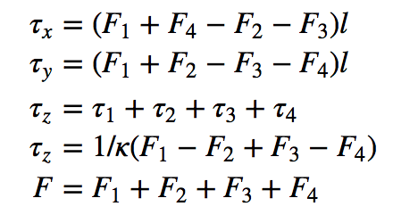
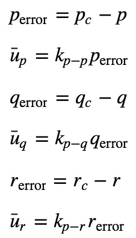
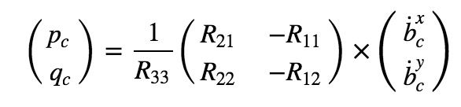
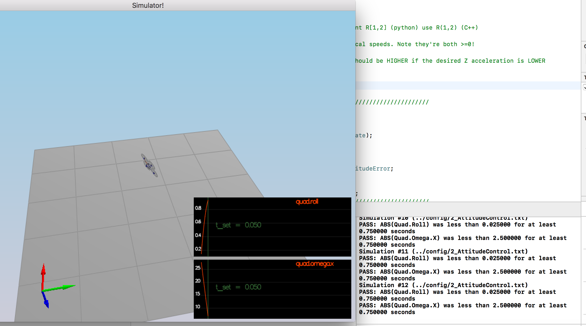
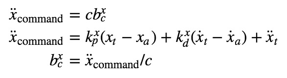
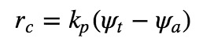
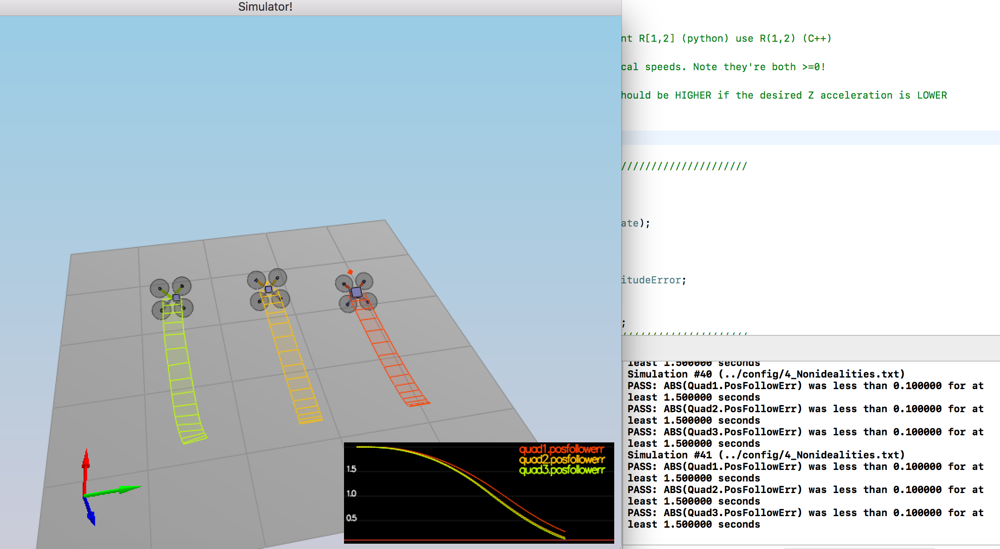

# The C++ Project Readme #

This is the readme for the C++ project.

## The Tasks ##

### Body rate and roll/pitch control (scenario 2) ###

#### Implement body rate control

##### implement the code in the function [`GenerateMotorCommands()`](src/QuadControl.cpp#L58-L94)
  - the formula:

  

##### implement the code in the function [`BodyRateControl()`](src/QuadControl.cpp#L96-L120)
  - The commanded roll, pitch, and yaw are collected by the body rate controller, and they are translated into the desired rotational accelerations along the axis in the body frame.
  - the fomula:

    

##### Tune `kpPQR` in `QuadControlParams.txt`
  - `kpPQR = 50, 50, 10`

#### Implement roll / pitch control

##### implement the code in the function [`RollPitchControl()`](src/QuadControl.cpp#L123-L171)

- The roll-pitch controller is a P controller responsible for commanding the roll and pitch rates in the body frame. It sets the desired rate of change of the given matrix elements using a P controller.

- the formula:
  
##### Tune `kpBank` in `QuadControlParams.txt`
- kpBank = 15

### Position/velocity and yaw angle control (scenario 3) ###

##### implement the code in the function [`LateralPositionControl()`](src/QuadControl.cpp#L214-L261)
  - The lateral controller will use a PD controller to command target values for elements of the drone's rotation matrix. The drone generates lateral acceleration by changing the body orientation which results in non-zero thrust in the desired direction. This will translate into the commanded rotation matrix elements $b^x_c$ and $b^y_c$.
  - the formula:

  

##### implement the code in the function [`AltitudeControl()`](src/QuadControl.cpp#L173-L211)

##### tune parameters `kpPosXY` and `kpPosZ`
- `kpPosXY = 3`
- `kpPosZ = 4`

##### tune parameters `kpVelXY` and `kpVelZ`
- `kpVelXY = 10`
- `kpVelZ = 11`

##### implement the code in the function [`YawControl()`](src/QuadControl.cpp#L264-L288)
  - Control over yaw is decoupled from the other directions. A P controller is used to control the drone's yaw.
  - the formula:

  

##### tune parameters `kpYaw` and the 3rd (z) component of `kpPQR`
  - `kpYaw = 2`
  - `kpPQR = 50, 50, 10`

**Hint:**  For a second order system, such as the one for this quadcopter, the velocity gain (`kpVelXY` and `kpVelZ`) should be at least ~3-4 times greater than the respective position gain (`kpPosXY` and `kpPosZ`).

### Non-idealities and robustness (scenario 4) ###
 

1. Edit `AltitudeControl()` to add basic integral control to help with the different-mass vehicle.

2. Tune the integral control, and other control parameters until all the quads successfully move properly.  

